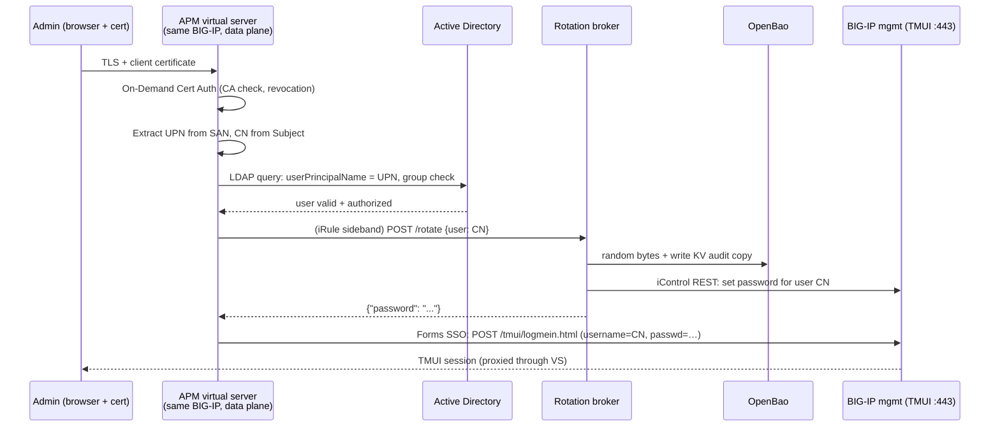

# Passwordless BIG-IP Web UI (TMUI) via APM Webtop + OpenBao

A setup runbook — **not part of the lab flow**. Nothing in the labs, `lab-vars.env`,
or the scripts changes. You run these steps directly against your BIG-IP (tmsh /
GUI / iControl REST) and against your OpenBao host.

**Goal:** administrators never type or know a BIG-IP password. They authenticate
to an APM webtop on the BIG-IP with a **client certificate** (optionally plus MFA).
APM extracts the **UPN from the certificate's SAN** and validates it against
**Active Directory**. During the access policy, APM calls **OpenBao** (through a
small rotation broker) which generates a random password, sets it on the matching
local BIG-IP account via iControl REST, and returns it. APM then performs
**forms-based SSO** into TMUI using the certificate **CN as the username** and the
just-rotated password. Every login gets a fresh, effectively single-use password.



---

## Read this first — what this is and is not

- **Passwordless for humans, not secretless.** Two machine credentials remain:
  the broker's BIG-IP service account (role `user-manager`) and the broker's
  OpenBao token/AppRole. Humans never see either.
- **Self-fronting = lockout risk.** The APM policy protects the same box's GUI.
  A broken policy locks you out of TMUI. **Do steps in order** — direct mgmt
  access is only restricted in step 10, *after* the flow is proven — and keep
  serial-console + one local break-glass admin forever.
- Scope is the **web UI only**. SSH, the lab harness's REST calls, and the CIS
  Kubernetes secret still use `BIGIP_USER`/`BIGIP_PASS` and are unaffected.
- Rotating a password does **not** kill existing TMUI/REST sessions, so a
  per-login rotation doesn't disturb a colleague's open session — but any
  script still using that account's old password breaks at the next call. Use
  **dedicated named admin accounts** for this flow (one per human, username =
  cert CN); never enroll `admin` or the account in the CIS secret.

## Prerequisites

| Piece | Requirement |
|---|---|
| BIG-IP | TMOS 15.1–17.x, **LTM + APM provisioned** (`tmsh modify sys provision apm level nominal`), APM access sessions licensed |
| PKI | Issuing CA whose user certs carry `userPrincipalName` in the SAN (smart-card style) and a Subject CN equal to the intended BIG-IP username |
| AD | Reachable from the BIG-IP data plane; a security group for BIG-IP admins (e.g. `BIGIP-Admins`) |
| OpenBao | Running, unsealed, reachable from the broker host; KV v2 mounted at `secret/` |
| Broker host | Any small Linux host (can be the OpenBao host) with Python 3.9+, reachable from the BIG-IP **data plane** (TMM), and able to reach the BIG-IP **mgmt** IP |
| Routing | The BIG-IP TMM (data plane) must be able to reach the broker; the broker must reach `https://<mgmt-ip>` |

Placeholders used below — substitute your values:

| Placeholder | Meaning | Example |
|---|---|---|
| `MGMT_IP` | BIG-IP management IP | `10.1.1.5` |
| `ADMIN_VIP` | Data-plane VIP that publishes TMUI | `10.1.10.50` |
| `BROKER_IP` | Rotation broker | `10.1.20.9:8443` |
| `BAO_ADDR` | OpenBao API | `https://10.1.20.9:8200` |
| `corp.example` | AD DNS domain | |

---

## 1. Break-glass first

```bash
# On the BIG-IP (console or existing session)
tmsh create auth user breakglass-admin partition-access add { all-partitions { role admin } } shell tmsh prompt-for-password
tmsh save sys config
```

Store this password offline (in OpenBao KV under a human-access policy is fine:
`bao kv put secret/bigip/breakglass password=…`). Verify serial/console access
works before continuing.

## 2. Create the broker's BIG-IP service account

`user-manager` can change other users' passwords but cannot alter system config:

```bash
tmsh create auth user svc-rotator partition-access add { all-partitions { role user-manager } } shell none prompt-for-password
tmsh save sys config
```

## 3. Create the named admin accounts (username = cert CN)

For each human, with the role they should hold in TMUI:

```bash
tmsh create auth user jdoe partition-access add { all-partitions { role admin } } shell none prompt-for-password
```

The initial password is irrelevant — the broker overwrites it at every login.

## 4. OpenBao: policy + AppRole for the broker

```bash
export BAO_ADDR=https://10.1.20.9:8200

cat > broker-policy.hcl <<'EOF'
path "sys/tools/random/*" {
  capabilities = ["update"]           # random password material
}
path "secret/data/bigip/tmui/*" {
  capabilities = ["create", "update"] # audit/recovery copy, write-only
}
EOF
bao policy write bigip-rotator broker-policy.hcl

bao auth enable approle 2>/dev/null || true
bao write auth/approle/role/bigip-rotator \
  token_policies=bigip-rotator token_ttl=15m token_max_ttl=30m
bao read  auth/approle/role/bigip-rotator/role-id          # -> ROLE_ID
bao write -f auth/approle/role/bigip-rotator/secret-id     # -> SECRET_ID
```

Enable audit logging if you haven't: `bao audit enable file file_path=/var/log/openbao-audit.log`.

## 5. The rotation broker

One small HTTPS service. Per request it: logs into Bao via AppRole → pulls 24
random bytes → sets that as the password of the requested user on the BIG-IP via
iControl REST → stores an audit copy in Bao KV → returns the password. It only
rotates users on an explicit allowlist, so a compromised APM session can never
rotate `admin`, `svc-rotator`, the CIS account, or `breakglass-admin`.

`/opt/bigip-rotator/rotator.py`:

```python
#!/usr/bin/env python3
"""Rotate a BIG-IP local user's password with OpenBao-sourced randomness."""
import json, os, ssl, urllib.request
from http.server import BaseHTTPRequestHandler, HTTPServer

BAO_ADDR   = os.environ["BAO_ADDR"]
ROLE_ID    = os.environ["BAO_ROLE_ID"]
SECRET_ID  = os.environ["BAO_SECRET_ID"]
BIGIP      = os.environ["BIGIP_MGMT"]          # e.g. 10.1.1.5
SVC_USER   = os.environ["ROTATOR_USER"]        # svc-rotator
SVC_PASS   = os.environ["ROTATOR_PASS"]
API_TOKEN  = os.environ["BROKER_TOKEN"]        # shared secret checked from APM
ALLOWED    = set(os.environ["ALLOWED_USERS"].split(","))  # e.g. jdoe,asmith

CTX = ssl.create_default_context()
if os.environ.get("INSECURE_TLS") == "1":      # lab only
    CTX = ssl._create_unverified_context()

def call(url, data=None, headers=None, method=None, auth=None):
    req = urllib.request.Request(url, data=json.dumps(data).encode() if data is not None else None,
                                 headers=headers or {}, method=method)
    req.add_header("Content-Type", "application/json")
    if auth:
        import base64
        req.add_header("Authorization", "Basic " + base64.b64encode(auth.encode()).decode())
    with urllib.request.urlopen(req, context=CTX, timeout=8) as r:
        return json.loads(r.read() or b"{}")

def rotate(user):
    tok = call(f"{BAO_ADDR}/v1/auth/approle/login",
               {"role_id": ROLE_ID, "secret_id": SECRET_ID})["auth"]["client_token"]
    h = {"X-Vault-Token": tok}
    rnd = call(f"{BAO_ADDR}/v1/sys/tools/random/24", {"format": "base64"}, h)
    pw = "Aa1!" + rnd["data"]["random_bytes"].rstrip("=")   # satisfies complexity policies
    call(f"https://{BIGIP}/mgmt/tm/auth/user/{user}", {"password": pw},
         method="PATCH", auth=f"{SVC_USER}:{SVC_PASS}")
    call(f"{BAO_ADDR}/v1/secret/data/bigip/tmui/{user}", {"data": {"password": pw}}, h)
    return pw

class H(BaseHTTPRequestHandler):
    def log_message(self, fmt, *a):  # never log bodies
        print(f"{self.client_address[0]} {self.command} {self.path}")
    def do_POST(self):
        if self.path != "/rotate" or self.headers.get("Authorization") != f"Bearer {API_TOKEN}":
            self.send_error(403); return
        body = json.loads(self.rfile.read(int(self.headers.get("Content-Length", 0)) or 2))
        user = body.get("user", "")
        if user not in ALLOWED:
            self.send_error(403); return
        try:
            out = json.dumps({"password": rotate(user)}).encode()
        except Exception as e:
            print(f"rotate failed for {user}: {e}"); self.send_error(502); return
        self.send_response(200)
        self.send_header("Content-Type", "application/json")
        self.send_header("Content-Length", str(len(out)))
        self.end_headers(); self.wfile.write(out)

srv = HTTPServer(("0.0.0.0", 8443), H)
srv.socket = ssl.wrap_socket(srv.socket, server_side=True,
    certfile="/opt/bigip-rotator/tls.crt", keyfile="/opt/bigip-rotator/tls.key")
srv.serve_forever()
```

Issue `tls.crt`/`tls.key` for the broker from your internal CA. Run it as a
locked-down systemd unit with the environment in
`/opt/bigip-rotator/env` (`chmod 600`, owned by a dedicated user):

```ini
# /etc/systemd/system/bigip-rotator.service
[Unit]
Description=BIG-IP TMUI password rotation broker
After=network-online.target
[Service]
User=bigip-rotator
EnvironmentFile=/opt/bigip-rotator/env
ExecStart=/usr/bin/python3 /opt/bigip-rotator/rotator.py
Restart=on-failure
NoNewPrivileges=yes
ProtectSystem=strict
ReadOnlyPaths=/opt/bigip-rotator
[Install]
WantedBy=multi-user.target
```

Smoke test from the broker host:

```bash
curl -sk https://127.0.0.1:8443/rotate -H "Authorization: Bearer $BROKER_TOKEN" \
     -H 'Content-Type: application/json' -d '{"user":"jdoe"}'
# -> {"password":"Aa1!…"}   and verify: curl -sk -u 'jdoe:<that pw>' https://MGMT_IP/mgmt/tm/sys/version
```

## 6. BIG-IP objects: CA, AAA, pool, SSO, virtual server

All in `/Common`. GUI paths given where the object is easier to build there.

### 6.1 Import the client CA and build SSL profiles

```bash
tmsh install sys crypto cert corp-user-ca from-local-file /var/tmp/corp-user-ca.pem
tmsh create ltm profile client-ssl tmui_clientssl {
  defaults-from clientssl
  cert-key-chain replace-all-with { default { cert default.crt key default.key } }
  ca-file corp-user-ca
  peer-cert-mode request        # APM On-Demand Cert Auth enforces "require"
}
tmsh create ltm profile server-ssl tmui_serverssl { defaults-from serverssl }
```

(Replace `default.crt/key` with a proper server cert for `ADMIN_VIP`'s hostname.
Add a CRL/OCSP configuration on the CA if you require revocation checking.)

### 6.2 AAA server: Active Directory

GUI: **Access ▸ Authentication ▸ Active Directory ▸ Create**
Name `aaa_ad`, Domain `corp.example`, Server(s) = your DCs. Direct/Pool per your
environment. (An admin bind account is only needed if anonymous queries are
disabled — most ADs need one; store *that* credential in OpenBao too.)

### 6.3 Pool pointing at TMUI

The pool member is the box's own mgmt IP — TMM must have a route to it and
`httpd` must accept the connection (source will be a self IP / floating self IP):

```bash
tmsh create ltm node tmui_node { address MGMT_IP }
tmsh create ltm monitor https tmui_monitor { defaults-from https send "GET /tmui/login.jsp HTTP/1.1\r\nHost: tmui\r\nConnection: close\r\n\r\n" recv "BIG-IP" }
tmsh create ltm pool tmui_pool { members replace-all-with { tmui_node:443 { address MGMT_IP } } monitor tmui_monitor }
```

If the monitor stays down, TMM cannot reach mgmt — add a route, and check
`tmsh list sys httpd allow` includes the egress self IP's subnet.

### 6.4 Forms-based SSO into TMUI

GUI: **Access ▸ Single Sign-On ▸ Forms Based ▸ Create**

| Field | Value |
|---|---|
| Name | `tmui_forms_sso` |
| Username Source | `session.sso.token.username` |
| Password Source | `session.sso.token.password` |
| Start URI | `/tmui/login.jsp*` |
| Form Action | `/tmui/logmein.html` |
| Form Parameter For User Name | `username` |
| Form Parameter For Password | `passwd` |
| Successful Detection Match Type | By Presence Of Specific Cookie |
| Successful Detection Cookie Name | `BIGIPAuthCookie` |

> Verify the three form values against *your* TMOS build: view source on
> `https://MGMT_IP/tmui/login.jsp` and check the `<form action=…>` and the two
> input names; they have been `logmein.html` / `username` / `passwd` across
> 15–17 but confirm before filing a ticket against this doc.

### 6.5 The sideband target for the broker

iRule `connect` speaks plaintext, so point it at an internal VS that adds TLS
toward the broker:

```bash
tmsh create ltm pool broker_pool { members replace-all-with { 10.1.20.9:8443 } }
tmsh create ltm virtual vs_broker_sideband {
  destination 10.255.255.10:8080 ip-protocol tcp
  profiles replace-all-with { tcp { } tmui_serverssl { context serverside } }
  pool broker_pool
  vlans-enabled vlans none    # not reachable from any external VLAN; sideband only
}
```

### 6.6 The rotation iRule

Create data group `dg_broker` holding the broker bearer token
(`tmsh create ltm data-group internal dg_broker type string records add { token { data <BROKER_TOKEN> } }`),
then the iRule:

```tcl
when ACCESS_POLICY_AGENT_EVENT {
    if { [ACCESS::policy agent_id] ne "bao_rotate" } { return }
    set user [ACCESS::session data get "session.custom.cn"]
    set tok  [class match -value "token" equals dg_broker]
    set body "{\"user\":\"$user\"}"
    set req  "POST /rotate HTTP/1.1\r\nHost: broker\r\nAuthorization: Bearer $tok\r\nContent-Type: application/json\r\nContent-Length: [string length $body]\r\nConnection: close\r\n\r\n$body"
    ACCESS::session data set "session.custom.bao_ok" 0
    if { [catch {
        set conn [connect -timeout 3000 -idle 10 -status cstat 10.255.255.10:8080]
        send -timeout 3000 -status sstat $conn $req
        set resp [recv -timeout 8000 -status rstat 16384 $conn]
        close $conn
        if { [regexp {"password"\s*:\s*"([^"]+)"} $resp -> pw] } {
            ACCESS::session data set -secure "session.custom.baopw" $pw
            ACCESS::session data set "session.custom.bao_ok" 1
            unset pw
        }
    } err] } { log local0.err "bao_rotate failed for $user: $err" }
}
```

The `-secure` flag keeps the password out of session dumps and APM logs.

### 6.7 Access profile and per-session policy

GUI: **Access ▸ Profiles/Policies ▸ Create** — name `tmui_access`, type **All**,
SSO Configuration = `tmui_forms_sso`, language as needed. Then open the policy in
the **Visual Policy Editor** and build:

```
Start
 ├─ On-Demand Cert Auth            (Auth Mode: Require)
 ├─ Variable Assign  "extract identity"
 ├─ AD Query                       (server aaa_ad)
 ├─ [optional MFA — see 6.8]
 ├─ iRule Event                    (ID: bao_rotate)   ← attach the iRule to the VS
 ├─ Empty ("rotation ok?")         branch: expr { [mcget {session.custom.bao_ok}] == 1 }
 ├─ SSO Credential Mapping
 └─ Advanced Resource Assign → Allow
(any other branch → Deny)
```

Agent details:

1. **Variable Assign — extract identity** (two entries, both *Custom Expression*):
   - `session.custom.upn` ⇐

     ```tcl
     set f [split [mcget {session.ssl.cert.x509extension}] "\n"];
     foreach x $f { if { [string first "othername:UPN" $x] >= 0 } {
       return [string range $x [expr {[string first "<" $x]+1}] [expr {[string first ">" $x]-1}]] } };
     return ""
     ```

   - `session.custom.cn` ⇐

     ```tcl
     if { [regexp {CN=([^,/]+)} [mcget {session.ssl.cert.subject}] -> cn] } { return $cn }; return ""
     ```

   (If your CA writes the SAN differently, dump a real session's
   `session.ssl.cert.x509extension` with `sessiondump` and adjust the parse.)

2. **AD Query**: SearchFilter `(userPrincipalName=%{session.custom.upn})`,
   fetch `memberOf` + `sAMAccountName`. Add a branch rule
   *AD Query passed AND* `[mcget {session.ad.last.attr.memberOf}] contains "CN=BIGIP-Admins"`.
   This is the LDAP validation of the certificate's UPN; a cert whose UPN has no
   (authorized) AD account stops here.

3. **iRule Event**: Custom iRule Event Agent ID = `bao_rotate`.

4. **SSO Credential Mapping**:
   - SSO Token Username = *Custom* → `mcget {session.custom.cn}`
   - SSO Token Password = *Custom* → `mcget -secure {session.custom.baopw}`

5. **Advanced Resource Assign**: for a plain reverse proxy, no resources are
   needed — Allow suffices and the VS's pool carries the traffic. If you want an
   actual **webtop**: create a Full webtop `tmui_webtop` and a **Webtop Link**
   `https://ADMIN_VIP/tmui/` and assign both; the user lands on the webtop and
   clicks through to TMUI. (Avoid a Portal Access/rewrite resource for TMUI —
   its heavy JavaScript does not survive content rewriting well; the
   LTM+APM reverse-proxy below is the reliable path.)

Set the profile's **Logout URI Include** to `/tmui/logout.jsp` so a TMUI logout
also kills the APM session, and set Inactivity Timeout ≈ TMUI's idle timeout
(`tmsh list sys httpd auth-pam-idle-timeout`).

### 6.8 Optional MFA slot

Between AD Query and the iRule Event, insert any of APM's native second factors:
**One-Time Passcode** (email/SMS via AD attributes), **RADIUS Auth** (points at
Duo/Okta RADIUS, etc.), or TOTP via a second AD Query against a token attribute.
Nothing downstream changes — the rotation and SSO steps are factor-agnostic.

### 6.9 The virtual server

```bash
tmsh create ltm virtual vs_tmui_admin {
  destination ADMIN_VIP:443 ip-protocol tcp
  profiles replace-all-with {
    tcp { } http { }
    tmui_clientssl { context clientside }
    tmui_serverssl { context serverside }
    tmui_access { }               # the access profile
    ppp { }                       # added automatically with APM on some builds
  }
  rules { bao_rotate_irule }
  pool tmui_pool
  source-address-translation { type automap }
}
tmsh save sys config
```

(If tmsh rejects the access-profile-in-profiles syntax on your build, attach it
in the GUI: Virtual Server ▸ Access Policy ▸ Access Profile.)

## 7. First end-to-end test (direct mgmt still open!)

1. Browser with an enrolled user cert → `https://ADMIN_VIP/`. Expect a cert
   prompt, (optional MFA), then TMUI already logged in as the CN user.
2. On the BIG-IP: `sessiondump --allkeys | grep -E 'custom\.(upn|cn|bao_ok)'`
   — `bao_ok` must be `1`; `baopw` must **not** appear in cleartext (secure var).
3. In OpenBao: `bao kv get secret/bigip/tmui/jdoe` shows the latest password;
   the audit log shows the AppRole login + random + KV write per admin login.
4. `tmsh show auth login-failures` / `/var/log/secure` on the BIG-IP shows the
   forms login from the VS self IP as user `jdoe`.
5. Negative tests: no cert → blocked at TLS/policy; valid cert but UPN not in
   `BIGIP-Admins` → Deny at AD Query; broker down → Deny at the `bao_ok` gate
   (and `ltm` log line `bao_rotate failed…`).

## 8. Troubleshooting

| Symptom | Look at |
|---|---|
| Policy denies at cert step | `/var/log/apm` (`tmsh modify apm log-setting …` or default-log-setting to debug); CA chain / revocation |
| `bao_ok = 0` | `/var/log/ltm` for the iRule error; broker journal (`journalctl -u bigip-rotator`); Bao audit log |
| SSO lands on the TMUI login page | Form action/field names (6.4), or the user's account doesn't exist locally (step 3), or password complexity rejected the generated value (`/var/log/secure`) |
| Pool member down | TMM→mgmt routing; `sys httpd allow` |
| Works, then 401s mid-session | You enrolled an account that something else (script/CIS) also uses — rotation broke it; use dedicated accounts |

## 9. TMUI behind the proxy — quirks

- Set the VS's server cert CN/SAN to the admin hostname and browse by name.
- TMUI is stateful and cookie-based; no rewriting is happening (reverse proxy,
  not Portal Access), so iApps/dashboards/WebSockets work as directly attached.
- Uploads (UCS, images) go through APM/TMM — raise `http` profile
  `max-header-size`/timeouts only if you actually hit limits.

## 10. Only now: close the side doors

Once the webtop path has been used for real work for a few days:

```bash
# Restrict direct mgmt httpd to the broker, your bastion, and BIG-IP's own self IP subnet
tmsh modify sys httpd allow replace-all-with { 10.1.20.9 10.1.99.0/24 10.1.10.0/24 }
# Keep sshd similarly scoped (SSH is out of scope here but don't leave it wide)
tmsh modify sys sshd allow replace-all-with { 10.1.99.0/24 }
tmsh save sys config
```

The broker must stay in `httpd allow` (it PATCHes user passwords over mgmt), and
the self-IP subnet must stay (the TMUI pool member connection). Do **not**
remove console access, and re-verify `breakglass-admin` after any change.

## 11. Hardening checklist

- [ ] Broker: real CA-issued TLS, `INSECURE_TLS` unset, env file `0600`, host firewalled to BIG-IP self IPs only
- [ ] OpenBao: audit device enabled; `bigip-rotator` policy is write-only on the KV path; humans read `secret/bigip/tmui/*` via a separate break-glass policy
- [ ] Rotate the `svc-rotator` password and `BROKER_TOKEN` on a schedule (they're the two remaining machine secrets)
- [ ] CRL/OCSP on the client CA; short-lived user certs if your PKI supports it
- [ ] APM: max sessions per user = 1–2; log setting captures cert subject + AD result; **never** raise SSO logging to a level that dumps posted forms
- [ ] Alert on: broker 5xx, `bao_rotate failed` in `/var/log/ltm`, logins for `breakglass-admin`
